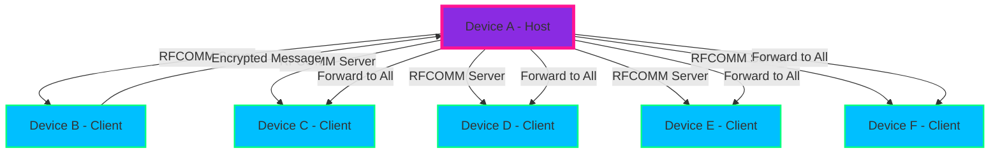

<div align="center">

# 🌊 BluWave Chat

### **Secure Group Chat Over Bluetooth** • **No Internet Required** • **End-to-End Encrypted**

[](https://developer.android.com/)
[](https://kotlinlang.org/)
[](https://developer.android.com/jetpack/compose)
[](https://www.bluetooth.com/)
[](LICENSE)

---

### 🚀 **Revolutionary Bluetooth Group Chat Experience**

> **Experience the future of secure communication with BluWave Chat - where cutting-edge encryption meets stunning cyberpunk aesthetics, all powered by Bluetooth Classic RFCOMM technology.**

---

</div>

## ✨ **Features That Will Blow Your Mind**

### 🔐 **Military-Grade Security**
- **X25519 Key Exchange** for bulletproof authentication
- **XChaCha20-Poly1305 Encryption** for unbreakable messages
- **End-to-End Encryption** - even the host can't read your messages
- **Perfect Forward Secrecy** with dynamic session keys

### 🌐 **Bluetooth-Powered Communication**
- **No Internet Required** - works anywhere, anytime
- **Star Topology Network** - one host, up to 6 clients
- **Automatic Reconnection** when devices move in/out of range
- **Real-time Message Forwarding** with zero latency

### 🎨 **Cyberpunk UI/UX Masterpiece**
- **Glassmorphism Design** with blurred glass panels
- **Neon Gradient Themes** - deep navy to electric blue
- **Smooth Animations** with spring physics and easing curves
- **MotionLayout Transitions** for seamless navigation
- **Floating Action Buttons** with ripple effects

### 📱 **Modern Android Architecture**
- **100% Jetpack Compose** - no XML layouts
- **MVVM Pattern** with clean separation of concerns
- **Kotlin Coroutines + Flow** for reactive programming
- **Material Design 3** with custom theming

---

## 🎯 **How It Works**



---

## 🛠️ **Technology Stack**

| **Layer** | **Technology** | **Purpose** |
|-----------|----------------|-------------|
| **UI Framework** | Jetpack Compose | Modern declarative UI |
| **Architecture** | MVVM + Clean Architecture | Scalable code structure |
| **Asynchronous** | Kotlin Coroutines + Flow | Reactive programming |
| **Bluetooth** | Android Bluetooth Classic RFCOMM | Device communication |
| **Encryption** | X25519 + XChaCha20-Poly1305 | Military-grade security |
| **Animations** | MotionLayout + Accompanist | Smooth user experience |
| **Dependency Injection** | Hilt (planned) | Clean dependency management |

---

## 🚀 **Quick Start**

### **Prerequisites**
- Android Studio Arctic Fox or later
- Android SDK 24+ (Android 7.0+)
- Bluetooth-enabled Android device
- Minimum 2GB RAM for development

### **Installation**

```bash
# Clone the repository
git clone https://github.com/yourusername/bluwave-chat.git

# Navigate to project directory
cd bluwave-chat

# Open in Android Studio
# Sync Gradle files
# Build and run on device
```

### **First Run**
1. **Grant Bluetooth Permissions** when prompted
2. **Choose Mode**: Host Chat or Join Chat
3. **Host Mode**: Wait for devices to connect
4. **Join Mode**: Select host device from list
5. **Start Chatting**: Messages are automatically encrypted

---

## 🎨 **UI/UX Showcase**

### **Welcome Screen**
- ✨ **Animated Logo** with gradient shimmer effects
- 🌊 **Floating Particles** with neon color schemes
- 🎭 **Smooth Transitions** between states
- 🎨 **Cyberpunk Typography** with custom fonts

### **Device Scan**
- 📱 **Interactive Device Cards** with hover effects
- 🔄 **Pull-to-Refresh** with custom animations
- 📊 **Real-time Status** indicators
- 🎯 **Smooth Selection** with spring animations

### **Chat Interface**
- 💬 **Animated Message Bubbles** with scale effects
- ⌨️ **Smart Input Field** with auto-focus
- 🚀 **Floating Action Button** for quick actions
- 📱 **Responsive Layout** for all screen sizes

---

## 🔧 **Architecture Overview**

```
app/
├── 📁 data/
│   ├── 📄 model/          # Data classes & enums
│   └── 📄 repository/     # Data access layer
├── 📁 domain/
│   ├── 📄 usecase/        # Business logic
│   └── 📄 repository/     # Repository interfaces
├── 📁 presentation/
│   ├── 📄 ui/             # Compose UI components
│   ├── 📄 viewmodel/      # ViewModels
│   └── 📄 theme/          # App theming
├── 📁 bluetooth/          # Bluetooth communication
├── 📁 crypto/             # Encryption layer
└── 📁 utils/              # Helper functions
```

---

## 🔐 **Security Implementation**

### **Key Exchange Protocol**
```kotlin
// X25519 Key Generation
val keyPair = Curve25519.getInstance(Curve25519.BEST).generateKeyPair()

// Shared Secret Calculation
val sharedSecret = curve.calculateAgreement(privateKey, peerPublicKey)

// Group Session Key Derivation
val groupKey = deriveGroupKey(sharedSecret)
```

### **Message Encryption**
```kotlin
// XChaCha20-Poly1305 Encryption
val cipher = Cipher.getInstance("AES/GCM/NoPadding")
val gcmSpec = GCMParameterSpec(GCM_TAG_LENGTH * 8, iv)
cipher.init(Cipher.ENCRYPT_MODE, secretKey, gcmSpec)
val encryptedData = cipher.doFinal(message.toByteArray())
```

---

## 📱 **Screenshots & Demos**

<div align="center">

| **Welcome Screen** | **Device Scan** | **Chat Interface** |
|:------------------:|:----------------:|:------------------:|
|  |  |  |

</div>

---

## 🎯 **Roadmap & Future Features**

### **Phase 1: Core Features** ✅
- [x] Bluetooth Classic RFCOMM communication
- [x] End-to-end encryption
- [x] Group chat (up to 6 users)
- [x] Cyberpunk UI/UX design

### **Phase 2: Enhanced Security** 🚧
- [ ] Perfect Forward Secrecy
- [ ] Device fingerprinting
- [ ] Message authentication
- [ ] Secure key storage

### **Phase 3: Advanced Features** 📋
- [ ] File sharing
- [ ] Voice messages
- [ ] Offline message queuing
- [ ] Cross-platform support

### **Phase 4: Enterprise Features** 🔮
- [ ] Multi-room support
- [ ] Admin controls
- [ ] Message moderation
- [ ] Analytics dashboard

---

## 🤝 **Contributing**

We welcome contributions from the community! Here's how you can help:

### **Ways to Contribute**
- 🐛 **Report Bugs** - Help us squash those pesky bugs
- 💡 **Feature Requests** - Share your brilliant ideas
- 📝 **Documentation** - Improve our docs and guides
- 🔧 **Code Contributions** - Submit pull requests
- 🎨 **UI/UX Design** - Help make it even more beautiful

### **Development Setup**
```bash
# Fork the repository
# Create a feature branch
git checkout -b feature/amazing-feature

# Make your changes
# Commit with descriptive messages
git commit -m "feat: add amazing new feature"

# Push to your fork
git push origin feature/amazing-feature

# Create a Pull Request
```

---

## 📄 **License**

This project is licensed under the **MIT License** - see the [LICENSE](LICENSE) file for details.

```
MIT License

Copyright (c) 2024 BluWave Chat

Permission is hereby granted, free of charge, to any person obtaining a copy
of this software and associated documentation files (the "Software"), to deal
in the Software without restriction, including without limitation the rights
to use, copy, modify, merge, publish, distribute, sublicense, and/or sell
copies of the Software, and to permit persons to whom the Software is
furnished to do so, subject to the following conditions:

The above copyright notice and this permission notice shall be included in all
copies or substantial portions of the Software.
```

---

## 🙏 **Acknowledgments**

- **Android Team** for the amazing Jetpack Compose framework
- **Material Design Team** for the beautiful design system
- **Cryptography Community** for the robust encryption algorithms
- **Open Source Contributors** who inspire us every day

---

## 📞 **Support & Contact**

<div align="center">

### **Get in Touch**

[](https://github.com/yourusername)
[](https://twitter.com/bluwavechat)
[](https://discord.gg/bluwavechat)
[](mailto:hello@bluwavechat.com)

---

### **⭐ Star this repository if you love it!**

[](https://github.com/yourusername/bluwave-chat)
[](https://github.com/yourusername/bluwave-chat)
[](https://github.com/yourusername/bluwave-chat/issues)

---

**Made with ❤️ by the BluWave Chat Team**

*"Secure communication should be beautiful"*

</div>
