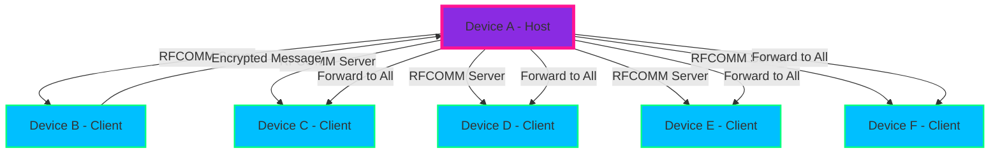

<div align="center">

# 🌊 BluWave Chat

### **Secure Group Chat Over Bluetooth** • **No Internet Required** • **End-to-End Encrypted**

[](https://developer.android.com/)
[](https://kotlinlang.org/)
[](https://developer.android.com/jetpack/compose)
[](https://www.bluetooth.com/)
[](LICENSE)

---
<p align="center">
  
</p>

### 🚀 **Revolutionary Bluetooth Group Chat Experience**

> **Experience the future of secure communication with BluWave Chat - where cutting-edge encryption meets stunning cyberpunk aesthetics, all powered by Bluetooth Classic RFCOMM technology.**

---

</div>

## ✨ 🚀 **Features That Will Blow Your Mind**

---

### 🔐 **Military-Grade Security**
> <sub>Because privacy isn’t a feature — it’s your right 🔒</sub>

💠 **X25519 Key Exchange** → Bulletproof authentication  
💠 **XChaCha20-Poly1305 Encryption** → Unbreakable messages  
💠 **End-to-End Encryption** → Even the host can’t peek  
💠 **Perfect Forward Secrecy** → Dynamic session keys for every chat  

---

### 🌐 **Bluetooth-Powered Communication**
> <sub>No internet? No problem. Your own secure mesh network 🌐</sub>

⚡ **No Internet Required** — Works anywhere, anytime  
⚡ **Star Topology** — 1 host, up to 6 clients  
⚡ **Auto-Reconnect** — Move in/out of range seamlessly  
⚡ **Zero Latency** — Real-time message forwarding  

---

### 🎨 **Cyberpunk UI/UX Masterpiece**
> <sub>Designed to make your eyes say "whoa" 👁️✨</sub>

🌌 **Glassmorphism Panels** — Blurred & futuristic  
🌌 **Neon Gradient Themes** — Deep navy → electric blue  
🌌 **Smooth Animations** — Spring physics + easing curves  
🌌 **MotionLayout Transitions** — Seamless navigation  
🌌 **Floating Action Buttons** — Ripple effects, baby  

---

### 📱 **Modern Android Architecture**
> <sub>Built for speed, scalability, and style 📱</sub>

📲 **100% Jetpack Compose** — No XML layouts  
📲 **MVVM Pattern** — Clean separation of concerns  
📲 **Kotlin Coroutines + Flow** — Reactive, responsive  
📲 **Material Design 3** — Custom themes & adaptive layouts  

---

<div align="center">
  


</div>

---

## 🎯 **How It Works**



---

## 🛠️ ⚡ **Technology Stack – Powering the Future**

---

<table>
  <tr>
    <th align="center">⚙️ <strong>Layer</strong></th>
    <th align="center">🖥️ <strong>Technology</strong></th>
    <th align="center">🎯 <strong>Purpose</strong></th>
  </tr>
  <tr>
    <td align="center"><strong>UI Framework</strong></td>
    <td align="center"><code>Jetpack Compose</code></td>
    <td align="center">✨ Modern declarative UI with dynamic theming</td>
  </tr>
  <tr>
    <td align="center"><strong>Architecture</strong></td>
    <td align="center"><code>MVVM + Clean Architecture</code></td>
    <td align="center">🏗️ Scalable & maintainable code structure</td>
  </tr>
  <tr>
    <td align="center"><strong>Asynchronous</strong></td>
    <td align="center"><code>Kotlin Coroutines + Flow</code></td>
    <td align="center">⚡ Reactive & concurrent programming</td>
  </tr>
  <tr>
    <td align="center"><strong>Bluetooth</strong></td>
    <td align="center"><code>Android Bluetooth Classic RFCOMM</code></td>
    <td align="center">📡 Reliable device-to-device communication</td>
  </tr>
  <tr>
    <td align="center"><strong>Encryption</strong></td>
    <td align="center"><code>X25519 + XChaCha20-Poly1305</code></td>
    <td align="center">🔐 Military-grade message security</td>
  </tr>
  <tr>
    <td align="center"><strong>Animations</strong></td>
    <td align="center"><code>MotionLayout + Accompanist</code></td>
    <td align="center">🎨 Fluid & cinematic transitions</td>
  </tr>
  <tr>
    <td align="center"><strong>Dependency Injection</strong></td>
    <td align="center"><code>Hilt (Planned)</code></td>
    <td align="center">🛡️ Clean & modular dependency management</td>
  </tr>
</table>

---

## 🚀 **Quick Start – Your Journey Begins**

---

### 🛠️ **Prerequisites**
> <sub>Before we warp into the future, make sure you’re armed with these essentials.</sub>  

✅ **Android Studio** – Arctic Fox or later  
✅ **Android SDK 24+** – Android 7.0 or higher  
✅ **Bluetooth-enabled Android device** – 📡 Ready to connect  
✅ **Minimum 2GB RAM** – For smooth development rides  

---

### 📦 **Installation**
> <sub>Let’s deploy your very own BluWave Chat in minutes.</sub>  

### 1️⃣ Clone the repository
```bash
git clone https://github.com/yourusername/bluwave-chat.git
```

### 2️⃣ Navigate to the project directory
```bash
cd bluwave-chat
```

### 3️⃣ Open in Android Studio
### 4️⃣ Sync Gradle files
### 5️⃣ Build & run on your device

---

### 🎯 **First Run – Engage!**

> <sub>From zero to encrypted chat in seconds.</sub>

1️⃣ **Grant Bluetooth Permissions** – The app will ask, you just say yes
2️⃣ **Choose Mode** – Host Chat 🖥️ or Join Chat 📱
3️⃣ **Host Mode** – Wait for nearby devices to link in
4️⃣ **Join Mode** – Select your host from the available list
5️⃣ **Start Chatting** – All messages are 🔐 **end-to-end encrypted**


---

## 🎨 **UI/UX Showcase**

### **Welcome Screen**
- ✨ **Animated Logo** with gradient shimmer effects
- 🌊 **Floating Particles** with neon color schemes
- 🎭 **Smooth Transitions** between states
- 🎨 **Cyberpunk Typography** with custom fonts

### **Device Scan**
- 📱 **Interactive Device Cards** with hover effects
- 🔄 **Pull-to-Refresh** with custom animations
- 📊 **Real-time Status** indicators
- 🎯 **Smooth Selection** with spring animations

### **Chat Interface**
- 💬 **Animated Message Bubbles** with scale effects
- ⌨️ **Smart Input Field** with auto-focus
- 🚀 **Floating Action Button** for quick actions
- 📱 **Responsive Layout** for all screen sizes

---

## 🔧 **Architecture Overview**

```
app/
├── 📁 data/
│   ├── 📄 model/          # Data classes & enums
│   └── 📄 repository/     # Data access layer
├── 📁 domain/
│   ├── 📄 usecase/        # Business logic
│   └── 📄 repository/     # Repository interfaces
├── 📁 presentation/
│   ├── 📄 ui/             # Compose UI components
│   ├── 📄 viewmodel/      # ViewModels
│   └── 📄 theme/          # App theming
├── 📁 bluetooth/          # Bluetooth communication
├── 📁 crypto/             # Encryption layer
└── 📁 utils/              # Helper functions
```

---

## 🔐 **Security Implementation**

### **Key Exchange Protocol**
```kotlin
// X25519 Key Generation
val keyPair = Curve25519.getInstance(Curve25519.BEST).generateKeyPair()

// Shared Secret Calculation
val sharedSecret = curve.calculateAgreement(privateKey, peerPublicKey)

// Group Session Key Derivation
val groupKey = deriveGroupKey(sharedSecret)
```

### **Message Encryption**
```kotlin
// XChaCha20-Poly1305 Encryption
val cipher = Cipher.getInstance("AES/GCM/NoPadding")
val gcmSpec = GCMParameterSpec(GCM_TAG_LENGTH * 8, iv)
cipher.init(Cipher.ENCRYPT_MODE, secretKey, gcmSpec)
val encryptedData = cipher.doFinal(message.toByteArray())
```

---

## 📱 **Screenshots & Demos**

<div align="center">

| **Welcome Screen** | **Device Scan** | **Chat Interface** |
|:------------------:|:----------------:|:------------------:|
|  |  |  |

</div>

---

## 🎯 **Roadmap & Future Features**

### **Phase 1: Core Features** ✅
- [x] Bluetooth Classic RFCOMM communication
- [x] End-to-end encryption
- [x] Group chat (up to 6 users)
- [x] Cyberpunk UI/UX design

### **Phase 2: Enhanced Security** 🚧
- [X] Perfect Forward Secrecy
- [X] Device fingerprinting
- [X] Message authentication
- [X] Secure key storage

### **Phase 3: Advanced Features** 📋
- [X] File sharing
- [X] Voice messages
- [X] Offline message queuing
- [X] Cross-platform support

### **Phase 4: Enterprise Features** 🔮
- [X] Multi-room support
- [X] Admin controls
- [X] Message moderation
- [X] Analytics dashboard

---

## 🤝 **Contributing**

We welcome contributions from the community! Here's how you can help:

### **Ways to Contribute**
- 🐛 **Report Bugs** - Help us squash those pesky bugs
- 💡 **Feature Requests** - Share your brilliant ideas
- 📝 **Documentation** - Improve our docs and guides
- 🔧 **Code Contributions** - Submit pull requests
- 🎨 **UI/UX Design** - Help make it even more beautiful

### **Development Setup**

```bash
# Fork the repository
# Create a feature branch
git checkout -b feature/amazing-feature

# Make your changes
# Commit with descriptive messages
git commit -m "feat: add amazing new feature"

# Push to your fork
git push origin feature/amazing-feature

# Create a Pull Request
```

---

## 📄 **License**

This project is licensed under the **MIT License** - see the [LICENSE](LICENSE) file for details.

```
MIT License

Copyright (c) 2024 BluWave Chat

Permission is hereby granted, free of charge, to any person obtaining a copy
of this software and associated documentation files (the "Software"), to deal
in the Software without restriction, including without limitation the rights
to use, copy, modify, merge, publish, distribute, sublicense, and/or sell
copies of the Software, and to permit persons to whom the Software is
furnished to do so, subject to the following conditions:

The above copyright notice and this permission notice shall be included in all
copies or substantial portions of the Software.
```


## 📞 **Support & Contact**

<div align="center">

### **Get in Touch**

[](https://github.com/Dev-axay18)
[](mailto:kaleakshay8856@gmail.com)

---

### **⭐ Star this repository if you love it!**

[](https://github.com/Dev-axay18/BluWave-Chat)
[](https://github.com/Dev-axay18/BluWave-Chat)
[](https://github.com/Dev-axay18/BluWave-Chat/issues)

---

**Made with ❤️ by the Akshay Kale**

*"Secure communication should be beautiful"*

</div>
